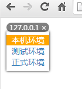

基于Nginx的环境切换器
====

## 原理
看代码

## 使用插件
放置在所有location的最前面
```nginx
server {
    listen 80;

    server_name www.mysite.com;

    access_log logs/localhost_access.log;
    error_log logs/localhost_error.log;
    
    # 环境切换器
    include _env_switch;

    location /{
        # ...
    }
    # ...
}
```

## 效果


## todo
1.不能用于 websocket之类的转发
